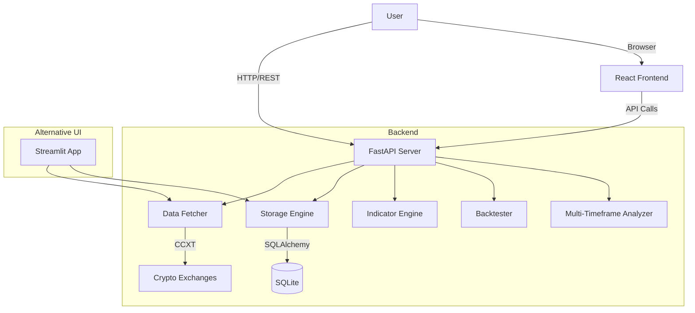

# Crypto Analysis Platform

A comprehensive cryptocurrency analysis and algorithmic trading research system.

## Quickstart

### Backend (FastAPI)
```bash
# Install dependencies
pip install -r requirements.txt

# Run API server
python api/main.py
# OR
uvicorn api.main:app --reload
```

### Frontend (React)
```bash
cd crypto-frontend

# Install dependencies
npm install

# Start development server
npm run dev
```

### Alternative UI (Streamlit)
For rapid prototyping and data visualization:
```bash
streamlit run app.py
```

## Architecture



## Core Components

### Backend Services
Located in `services/`:
- **Data Fetcher**: Integrates with exchanges via CCXT to fetch OHLCV data.
- **Storage Engine**: Manages SQLite database interactions using SQLAlchemy.
- **Indicator Engine**: Calculates technical indicators (RSI, MACD, BB, ATR, Ichimoku).
- **Backtester**: Simulates trading strategies against historical data.
- **Multi-Timeframe Analyzer**: Analyzes trends across multiple timeframes.

### API Endpoints
Defined in `api/main.py`:
- `GET /api/v1/watchlists`: Manage asset watchlists.
- `GET /api/v1/ohlcv/{symbol}/{timeframe}`: Retrieve historical market data.
- `GET /api/v1/indicators/{symbol}/{timeframe}`: Calculate indicators on the fly.
- `POST /api/v1/backtest`: Run strategy backtests.
- `GET /api/v1/multi-timeframe/{symbol}`: Get cross-timeframe analysis.

### Frontend
Located in `crypto-frontend/`:
- **Tech Stack**: React 19, Vite, TypeScript, Tailwind CSS, Zustand, TanStack Query.
- **Visualization**: Lightweight Charts, Recharts/Plotly (via components).

## Configuration
Configuration is managed via YAML files in `config/`:
- `main.yaml`: General settings (database path, default parameters).
- `watchlists.yaml`: User-defined watchlists and assets.

## Evidence Appendix

### Project Structure
- **Root**: `c:\workspaces\crypto-analysis` [[EVID: c:\workspaces\crypto-analysis\requirements.txt:L1-L11 | Python dependencies]]
- **Backend Entry**: `api/main.py` [[EVID: c:\workspaces\crypto-analysis\api\main.py:L32-L32 | FastAPI app initialization]]
- **Frontend Entry**: `crypto-frontend/src/main.tsx` (implied by Vite) [[EVID: c:\workspaces\crypto-analysis\crypto-frontend\package.json:L7-L8 | Vite scripts]]
- **Streamlit App**: `app.py` [[EVID: c:\workspaces\crypto-analysis\app.py:L1-L12 | Streamlit app setup]]

### Dependencies
- **Python**: `fastapi`, `uvicorn`, `ccxt`, `pandas`, `sqlalchemy`, `streamlit` [[EVID: c:\workspaces\crypto-analysis\requirements.txt:L1-L10 | Requirements list]]
- **Node.js**: `react`, `vite`, `tailwindcss`, `zustand`, `lightweight-charts` [[EVID: c:\workspaces\crypto-analysis\crypto-frontend\package.json:L12-L31 | Package dependencies]]

### Services
- **Data Fetcher**: `services/data_fetcher.py` [[EVID: c:\workspaces\crypto-analysis\api\main.py:L14-L14 | Import DataFetcher]]
- **Storage**: `services/storage.py` [[EVID: c:\workspaces\crypto-analysis\api\main.py:L15-L15 | Import StorageEngine]]
- **Indicators**: `services/indicators.py` [[EVID: c:\workspaces\crypto-analysis\api\main.py:L16-L16 | Import IndicatorEngine]]
- **Backtester**: `services/backtester.py` [[EVID: c:\workspaces\crypto-analysis\api\main.py:L17-L17 | Import Backtester]]

### API Routes
- **Watchlists**: `/api/v1/watchlists` [[EVID: c:\workspaces\crypto-analysis\api\main.py:L63-L63 | Watchlist endpoint]]
- **OHLCV**: `/api/v1/ohlcv/{symbol}/{timeframe}` [[EVID: c:\workspaces\crypto-analysis\api\main.py:L136-L136 | OHLCV endpoint]]
- **Backtest**: `/api/v1/backtest` [[EVID: c:\workspaces\crypto-analysis\api\main.py:L227-L227 | Backtest endpoint]]
